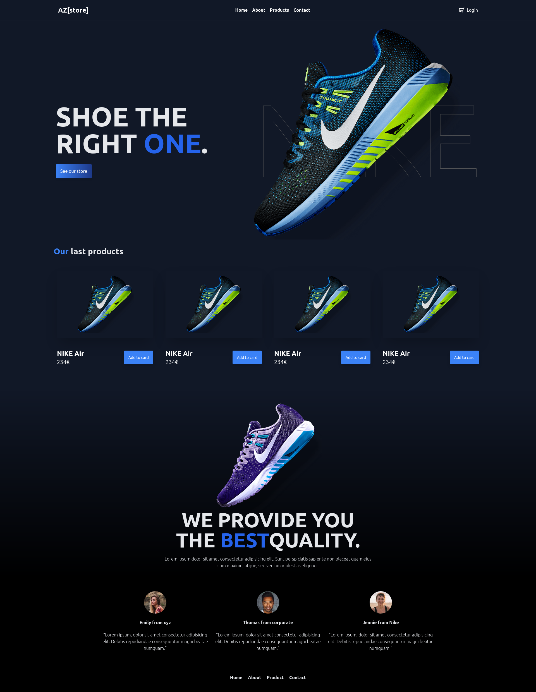

# az-store
## Project overview
Type of challenge : consolidation
Duration : 3 days
Group : 3 people
## Groups
Group 3: Lyne, Adrien C., Maryam, Stacy 

## Learning objectives
Use variables, conditions, loops, functions, and sessions.
Read data from a JSON file in PHP.
## The Mission
You are a web developer for a web agency and your boss has asked you to create a small shopping cart for a website of a client (see below). The shopping cart should be able to add and remove products. The shopping cart should also be able to display the total price of the products in it.

## Pages
index.php :
The home page (it should display the products).
Each product should have a button to add it to the shopping cart.
shopping-cart.php :
the shopping cart page (it should display the products in the shopping cart).
The shopping cart should have a button to remove a product from the shopping cart
The shopping cart should have a button to go to the checkout page
Checkout.php :
The checkout page (it should display the products in the shopping cart).
The checkout page should have a form to give informations for the shipping
The checkout page should have a button, after submiting the form, just display a message "Thank you for your order" and empty the shopping cart.
Must-have features
The user should be able to add a product to the shopping cart.
The user should be able to remove a product from the shopping cart.
The user should be able to see the total price of the products in the shopping cart. (Hard Bonus : including VAT)
Use sessions to store the shopping cart.
use an array to store the products. Each product should be an array.
Good to know
Use the assets folder to get the images

You can use tailwindcss or other CSS frameworks to style the website.

The form should have the following fields:

First name
Last name
Email
Address
City
Zip code
Country
Don't forget to validate the form (all fields are required, email should be a valid email, zip code should be a number, etc...).

Don't forget to sanitize the data (remove the spaces, remove the special characters, etc...).

To read data from the JSON file in PHP, use the following code:
  $productsJson = file_get_contents('products.json');
  $products = json_decode($productsJson, true);
Deliverables
Just a repository on github with the code is enough. (You will learn how to deploy your website later).
Printscreen
The client wants the website to look like this. Create the pages and make them look like this. You can use the images in the assets folder.

